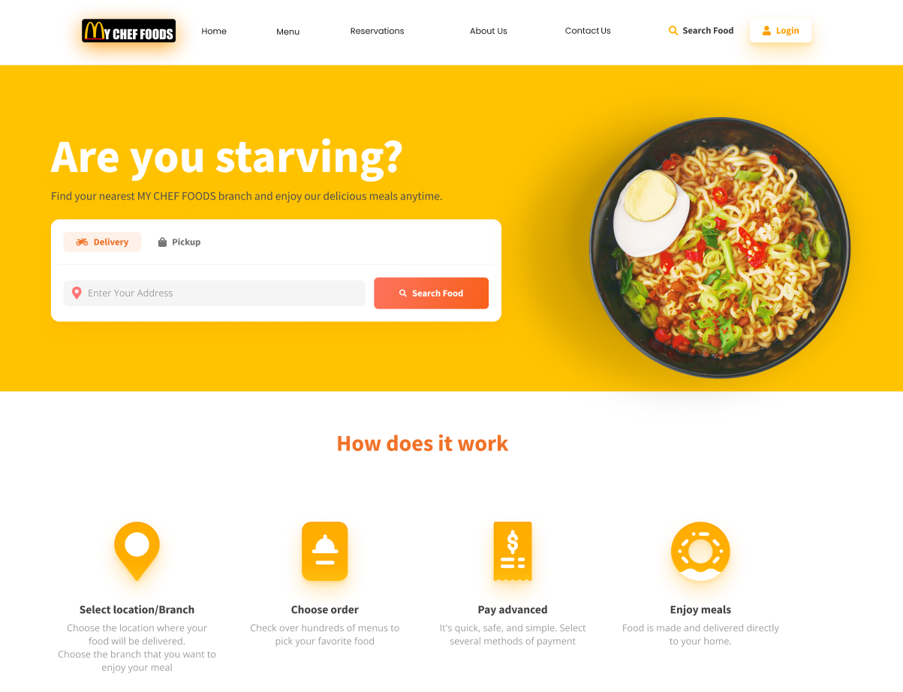

# 🍴 My Chef Foods

**My Chef Foods** is a full-stack food delivery and recipe management web application.  
It provides users with an easy way to explore recipes, manage meals, and order food online.  
The project includes both frontend, backend, and database integration.  

---

## 🎨 Figma Design (UI/UX by Abhilash)

[](https://www.figma.com/design/hh78FaGVxVbrYnEaNF8iL3/My-chef?node-id=36-923&t=YBrAhxlCVcy9Oa8c-1)  

*Click the image to view the full design on Figma.*  

---

## 🛠️ Tech Stack

- **Frontend:** HTML, CSS, JavaScript  
- **Backend:** Node.js (placeholder — update if different)  
- **Database:** MongoDB  
- **Design & Prototyping:** Figma  

---

## 🚀 Getting Started

### 1️⃣ Clone the Repository
```bash
git clone https://github.com/YOUR_USERNAME/YOUR_REPO_NAME.git
cd YOUR_REPO_NAME
